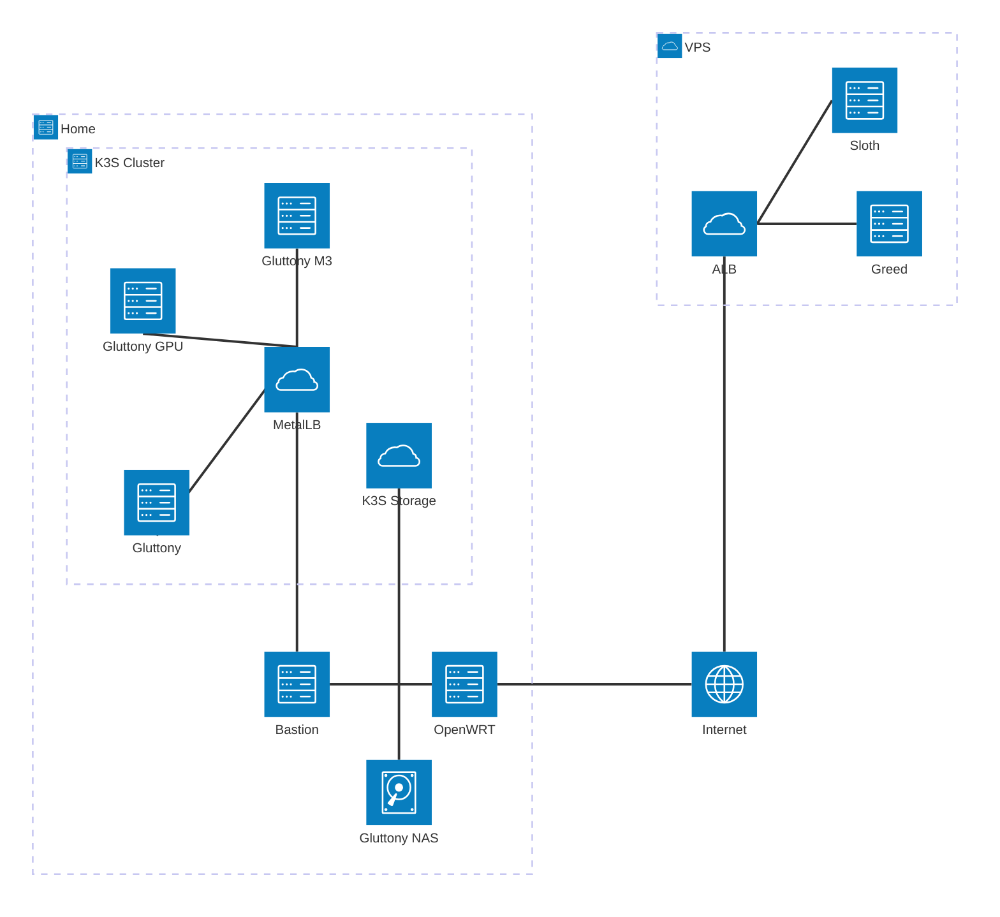

# Cluster Architecture

The cluster consists of a [`k3s`](https://k3s.io) cluster, a dedicated bastion host 
running an nginx reverse proxy, and a dedicated NAS.

An interesting thing to note is that all server equipment (all hosts listed above) 
reside in a deticated VLAN to isolate them from other hosts on the network.

Although not exactly like an enterprise network, within my subnetting I have accounted
for multiple physical locations, each with networks of servers, mobile clients, and
normal clients.
