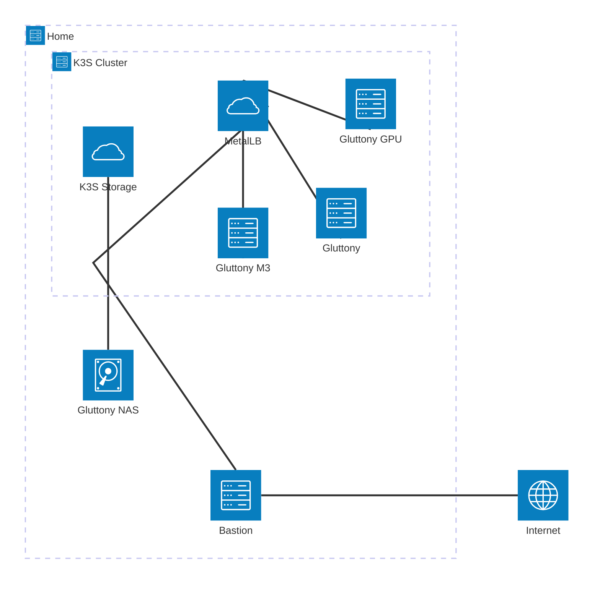

# Cluster Architecture

The cluster consists of a `k3s` cluster, a dedicated bastion host 
running an nginx reverse proxy, and a dedicated NAS.

```mermaid
architecture-beta
  service internet(internet)[Internet]

  group home(server)[Home]

  service bastion(server)[Bastion] in home
  service nas(disk)[Gluttony NAS] in home

  group cluster(server)[K3S Cluster] in home

  service gluttony(server)[Gluttony] in cluster
  service gluttonygpu(server)[Gluttony GPU] in cluster
  service gluttonym3(server)[Gluttony M3] in cluster

  service metallb(cloud)[MetalLB] in cluster
  service storage(cloud)[K3S Storage] in cluster


  internet:L -- R:bastion
  bastion:T -- R:metallb

  metallb:T -- B:gluttony
  metallb:T -- B:gluttonygpu
  metallb:T -- B:gluttonym3
  

  storage:B -- T:nas


```
